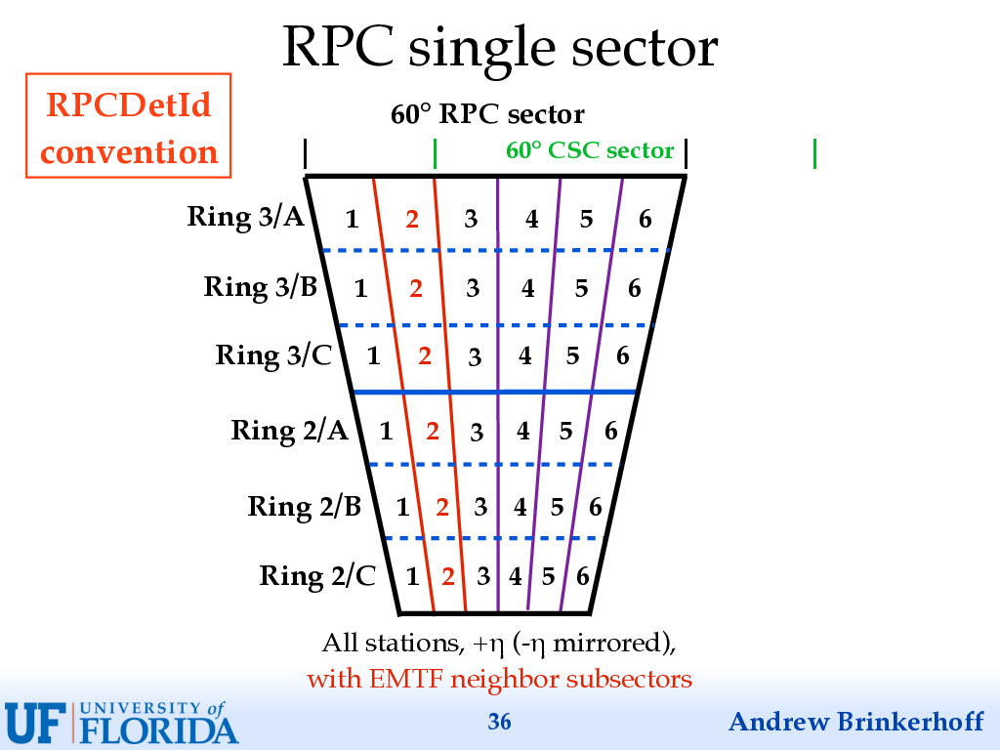

# EMTF Resources

This page contains links to various resources that are relevant for the [CMS](https://cms.cern/)
Endcap Muon Track Finder (EMTF) &mdash; the L1 [trigger](https://cms.cern/detector/triggering-and-data-acquisition)
for muons in the forward region (1.24 < |&eta;| < 2.4).

For an introduction to the EMTF system, please check out the following:
- D. Acosta, [Endcap Muon Trigger System Overview](https://indico.cern.ch/event/830333/contributions/3477682/attachments/1867800/3072044/EMTFhardwareOverview.pdf). (2019-06-24)
- A. Brinkerhoff, [The EMTF System and Projects for Run 3](https://indico.cern.ch/event/830333/contributions/3477682/attachments/1867800/3072125/2019_06_24_EMTF_system_Run3.pdf). (2019-06-24)
- E. Yiğitbaşı, [EMTF Emulator Status and Plans](https://indico.cern.ch/event/900292/contributions/3798560/attachments/2008546/3355213/EMTF_emulator_review_L1Tweekly_24.03.2020.pdf). (2020-03-24)

For an introduction to the L1 online software, please check out the following:
- G. Dirkx, [CMS Level-1 Trigger Online Software](https://indico.cern.ch/event/914784/contributions/3846235/attachments/2054240/3444025/induction_course_10_jun_2020.pdf). (2020-06-11)

For an introduction to the Trigger & DAQ systems in CMS, please check out the following Darin Acosta's lectures:
- D. Acosta, [Introduction to Trigger Systems](https://indico.cern.ch/event/793524/contributions/3296564/subcontributions/273567/attachments/1788844/2913452/TriggerLecture.pdf). (2019-01-31)
- D. Acosta, [Electronics in High Energy Physics](https://indico.cern.ch/event/793524/contributions/3296564/subcontributions/273567/attachments/1788844/2913453/ElectronicsLecture.pdf). (2019-01-31)

## Table of contents

- [Wikis](#wikis)
- [Code Repositories](#code-repositories)
- [Issue Tracking](#issue-tracking)
- [Web Monitoring Tools](#web-monitoring-tools)
- [Meetings and News](#meetings-and-news)
- [Documents](#documents)
- [Lectures, Courses and Tutorials](#lectures-courses-and-tutorials)
- [Workshops and Other Events](#workshops-and-other-events)
- [Figures](#figures)

## Wikis

### Offline Software

- [EMTFAnalyzer](https://twiki.cern.ch/twiki/bin/view/CMS/EMTFAnalyzer) - EMTF Analyzer Tools and Coordination
- [EndcapMuonTrigger](https://twiki.cern.ch/twiki/bin/view/CMS/EndcapMuonTrigger) - Endcap Muon Level 1 Trigger LS1 upgrade page
  > Contains MTF7 & EMTF documentation and source codes.
- [L1CSCTrackFinder](https://twiki.cern.ch/twiki/bin/view/CMS/L1CSCTrackFinder) - L1 CSC Track-Finder
  > Contains CSCTF documentation and source codes. Note that CSCTF has been superseded by EMTF.
- [L1CSCTriggerPrimitives](https://twiki.cern.ch/twiki/bin/view/CMS/L1CSCTriggerPrimitives) - L1 CSC Trigger Primitives
  > Contains CSC trigger primitive documentation.
- [SWGuideL1TOfflineDev](https://twiki.cern.ch/twiki/bin/view/CMSPublic/SWGuideL1TOfflineDev) - L1T Offline Development Planning Page
  > Provides instructions for developing L1 Trigger emulator code, in particular the L1T NTuple code.
- [SWGuideL1TStage2Instructions](https://twiki.cern.ch/twiki/bin/view/CMSPublic/SWGuideL1TStage2Instructions) - L1 Trigger Emulator Stage 2 Upgrade Instructions
  > Provides instructions for running L1 Trigger emulator, in particular the L1T NTuples.
- [SWGuideL1TPhase2Instructions](https://twiki.cern.ch/twiki/bin/view/CMSPublic/SWGuideL1TPhase2Instructions) - L1 Trigger Emulator Phase-2 Upgrade Instructions
  > Provides instructions for running L1 Trigger emulator for Phase-2 Upgrade.

- [L1Trigger](https://twiki.cern.ch/twiki/bin/view/CMS/L1Trigger) - Level-1 Trigger
  - [L1TriggerDPGResults](https://twiki.cern.ch/twiki/bin/view/CMSPublic/L1TriggerDPGResults) - Level-1 Trigger Public Performance Results
  - [L1TriggerPhase1](https://twiki.cern.ch/twiki/bin/view/CMS/L1TriggerPhase1) - Phase 1 L1 Trigger Upgrades
  - [L1TriggerPhase2](https://twiki.cern.ch/twiki/bin/view/CMS/L1TriggerPhase2) - Phase-2 L1 Trigger Upgrade

- [SWGuideGlobalHLT](https://twiki.cern.ch/twiki/bin/view/CMSPublic/SWGuideGlobalHLT) - High Level Trigger
  - [HighLevelTriggerPhase2](https://twiki.cern.ch/twiki/bin/view/CMS/HighLevelTriggerPhase2) - Phase-2 High Level Trigger Upgrade
  - [TriggerStudiesTalks](https://twiki.cern.ch/twiki/bin/view/CMSPublic/TriggerStudiesTalks) - Talks and posters about the CMS High Level Trigger

- [MuonWikiHome](https://twiki.cern.ch/twiki/bin/view/CMS/MuonWikiHome) - CMS Muon Wiki Pages
  - [MuonDPGOffice](https://twiki.cern.ch/twiki/bin/view/CMS/MuonDPGOffice) - Muon DPG Office
  - [MuonDT](https://twiki.cern.ch/twiki/bin/view/CMS/MuonDT) - Muon DT
  - [MuonCSC](https://twiki.cern.ch/twiki/bin/view/CMS/MuonCSC) - Muon CSC
    - [CSCDPGGeometry](https://twiki.cern.ch/twiki/bin/view/CMS/CSCDPGGeometry) - CSC Geometry
    - [CSCDPGFigures](https://twiki.cern.ch/twiki/bin/view/CMS/CSCDPGFigures) - CSC-related figures and diagrams
  - [RPComm](https://twiki.cern.ch/twiki/bin/view/CMS/RPComm) - Muon RPC
  - [MuonGEM](https://twiki.cern.ch/twiki/bin/view/CMS/MuonGEM) - Muon GEM
    - [GEMCSCIntegratedLocalTrigger](https://twiki.cern.ch/twiki/bin/view/CMS/GEMCSCIntegratedLocalTrigger) - GEM Trigger Road Map

- Specific for Run 2:
  - [L1TriggerPhaseIDiagrams](https://twiki.cern.ch/twiki/bin/view/CMS/L1TriggerPhaseIDiagrams) - Level-1 Trigger Phase I Upgrade Diagrams
  - [L1KnownIssues](https://twiki.cern.ch/twiki/bin/view/CMS/L1KnownIssues) - L1T known issues in 2016 to 2018
  - [CSCOTMB2018](https://twiki.cern.ch/twiki/bin/view/CMS/CSCOTMB2018) - CSC OTMB and relevant configuration tests in autumn 2018
    > Describes the modified CSC LCT algorithm versions tested in data in 2018.

- Specific for Run 3:
  - [CscLctGemEmtfRun3](https://twiki.cern.ch/twiki/bin/view/CMS/CscLctGemEmtfRun3) - Coordination of CSC LCT + GEM with EMTF for Run 3
    > Describes the studies related to GEM TPs in the EMTF (no longer updated).
  - [GEMCSCTriggerTaskForceRun3](https://twiki.cern.ch/twiki/bin/view/CMS/GEMCSCTriggerTaskForceRun3) - GEM CSC Trigger Task Force Run-3
    > Describes the studies related to GEM & CSC TPs for Run-3.

- Specific for Phase 2:
  - [CMSMuonLocalTriggerPhase2](https://twiki.cern.ch/twiki/bin/view/CMS/CMSMuonLocalTriggerPhase2) - CMS Muon Local Trigger for HL-LHC

- Non-Wikis:
  - CMS CSC Level-1 Track Finder Home Page
    - <http://cms-csctf.web.cern.ch/>
  - Darin Acosta's CSC Track-Finder webpage
    - <http://www.phys.ufl.edu/~acosta/cms/trigger.html>
  - UCLA CSC Trigger webpage
    - <http://cmsdoc.cern.ch/cms/MUON/cscTrigger/html/CERN/>
  - TriDAS Muon Trigger Home Page
    - <http://cmsdoc.cern.ch/ftp/afscms/TRIDAS/mutrig/html/>

### Online Software

- [EMTFOnCallExpert](https://twiki.cern.ch/twiki/bin/view/CMS/EMTFOnCallExpert) - L1 EMTF Expert Page
  > Contains info for the EMTF on-call shifters, but has lots of other info, including a [list of other EMTF pages](https://twiki.cern.ch/twiki/bin/view/CMS/EMTFOnCallExpert#Important_Twiki_Pages).
- [EMTFSwatchControlSoftware](https://twiki.cern.ch/twiki/bin/view/CMS/EMTFSwatchControlSoftware) - EMTF SWATCH Control Software
  > Contains instructions for the EMTF SWATCH software.
- [OnlineWBTrigger](https://twiki.cern.ch/twiki/bin/view/CMS/OnlineWBTrigger) - CMS Trigger Online Workbook
- [ClusterUsersGuide](https://twiki.cern.ch/twiki/bin/view/CMS/ClusterUsersGuide) - .CMS Cluster user's guide

- Non-Wikis:
  - SWATCH's documentation
    - <http://cactus.web.cern.ch/cactus/release/swatch/latest_doc/>

## Code Repositories

### Offline Software

- [DataFormats/L1TMuon](https://github.com/cms-sw/cmssw/tree/master/DataFormats/L1TMuon) - EMTF data formats
- [L1Trigger/L1TMuonEndCap](https://github.com/cms-sw/cmssw/tree/master/L1Trigger/L1TMuonEndCap) - EMTF emulator
- [EventFilter/L1TRawToDigi](https://github.com/cms-sw/cmssw/tree/master/EventFilter/L1TRawToDigi) - EMTF DAQ
- [DQM/L1TMonitor](https://github.com/cms-sw/cmssw/tree/master/DQM/L1TMonitor) - EMTF DQM
- [L1TriggerConfig/L1TConfigProducers](https://github.com/cms-sw/cmssw/tree/master/L1TriggerConfig/L1TConfigProducers) - EMTF O2O

### Online Software

- [core/ts](https://gitlab.cern.ch/cms-cactus/core/ts) - Trigger Supervisor
- [core/swatch](https://gitlab.cern.ch/cms-cactus/core/swatch) - SWATCH
- [projects/emtf](https://gitlab.cern.ch/cms-cactus/projects/emtf/) - EMTF SWATCH cell

## Issue Tracking

### Offline Software

- &nbsp;

### Online Software

- [CMSL1TOPS](https://its.cern.ch/jira/projects/CMSLITOPS/summary) - CMS Level-1 Trigger Operations
- [CMSL1TDPG](https://its.cern.ch/jira/projects/CMSLITDPG/summary) - CMS Level-1 Trigger DPG
- [CMSONS](https://its.cern.ch/jira/projects/CMSONS/summary) - CMS Online Networks and Systems

## Web Monitoring Tools

- EMTF SWATCH Cell
  - <http://l1ts-emtf.cms:3333/urn:xdaq-application:lid=13/>
- EMTF IPMITools Monitor
  - <http://l1ts-emtf.cms:4200/>
- [OMS](https://cmsoms.cern.ch/) - CMS Online Monitoring System
- [WBM](https://cmswbm.cern.ch/cmsdb/servlet/RunSummary) - CMS Web-Based Monitoring (obsolete)
- [DQM/Online](https://cmsweb.cern.ch/dqm/online/) - CMS Online DQM
- [DQM/Offline](https://cmsweb.cern.ch/dqm/offline/) - CMS Offline DQM
- [DQM/RelVal](https://cmsweb.cern.ch/dqm/relval/) - CMS RelVal DQM
- [Elog](https://cmsonline.cern.ch/webcenter/portal/cmsonline/pages_common/elog) - CMS Online Elog
- [DAQ](https://cmsonline.cern.ch/webcenter/portal/cmsonline/pages_common/daq) - CMS Online DAQ
- [L1Page](https://l1page.cms/) - L1 Page
- [L1CE](https://l1ce.cms/) - L1 Configuration Editor

## Meetings and News

### Meetings

- [MUON](https://indico.cern.ch/category/20/) [![Indico][indico]](https://indico.cern.ch/category/20/)
  - EMTF Working Meeting
  - CSC Weekly Meeting
  - GEM-CSC Trigger Task Force Meeting

- [TRIGGER](https://indico.cern.ch/category/2091/) [![Indico][indico]](https://indico.cern.ch/category/2091/)
  - Level-1 Trigger Weekly Meeting
  - L1T Operations
  - L1T DPG meeting
  - L1T Offline SW Meeting
  - Phase-2 L1 Trigger Muon Algorithms Group Meeting

- [CMS WEEKS](https://indico.cern.ch/category/154/) [![Indico][indico]](https://indico.cern.ch/category/154/)

### Hypernews

- [L1Trigger](https://hypernews.cern.ch/HyperNews/CMS/get/L1Trigger.html) - L1 Trigger
- [L1TriggerSW](https://hypernews.cern.ch/HyperNews/CMS/get/L1TriggerSW.html) - L1 Trigger Software
- [L1TriggerUpgrades](https://hypernews.cern.ch/HyperNews/CMS/get/L1TriggerUpgrades.html) - L1 Trigger Upgrades
- [commissioning](https://hypernews.cern.ch/HyperNews/CMS/get/commissioning.html) - Commissioning

### E-groups

- [csctf-working-meeting](https://e-groups.cern.ch/e-groups/Egroup.do?egroupName=csctf-working-meeting) - CSCTF working group
- [cms-l1t-emulator-muons](https://e-groups.cern.ch/e-groups/Egroup.do?egroupName=cms-l1t-emulator-muons) - Experts of muons L1 trigger emulator (EMTF,OMTF,BMTF,uGMT)
- [cms-l1t-emulator-muons-endcap](https://e-groups.cern.ch/e-groups/Egroup.do?egroupName=cms-l1t-emulator-muons-endcap) - L1T endcap muon trigger (EMTF) algorithms and software
- [cms-l1t-csc-lct-gem-run3](https://e-groups.cern.ch/e-groups/Egroup.do?egroupName=cms-l1t-csc-lct-gem-run3) - Coordination of LCT and GEM trigger primitive developments
- [cms-l1p2-muon-algo](https://e-groups.cern.ch/e-groups/Egroup.do?egroupName=cms-l1p2-muon-algo) - E-group for Phase-2 L1 muon algorithms
- [cms-gem-csc-trigger-taskforce](https://e-groups.cern.ch/e-groups/Egroup.do?egroupName=cms-gem-csc-trigger-taskforce) - GEM-CSC trigger task force

### Mattermost

- [cms-emtf](https://mattermost.web.cern.ch/cms-emtf) - CMS EMTF

## Documents

### TDRs

- CMS Collaboration, [The CMS muon project : Technical Design Report](https://cds.cern.ch/record/343814), CERN-LHCC-97-032, CMS-TDR-3. (1997) ![tag-muon][tag-muon] [![Inspire][inspire]](http://inspirehep.net/record/1614056)
  - See also: <https://twiki.cern.ch/twiki/bin/view/CMS/MuonTDR>
- CMS Collaboration, [CMS TriDAS project : Technical Design Report, Volume 1: The Trigger Systems](https://cds.cern.ch/record/706847), CERN-LHCC-2000-038, CMS-TDR-6-1. (2000) ![tag-l1][tag-l1] [![Inspire][inspire]](http://inspirehep.net/record/541210)
  - See also: <http://cmsdoc.cern.ch/cms/TDR/TRIGGER-public/trigger.html>
- CMS Collaboration, [CMS The TriDAS Project : Technical Design Report, Volume 2: Data Acquisition and High-Level Trigger](https://cds.cern.ch/record/578006), CERN-LHCC-2002-026, CMS-TDR-6. (2002) ![tag-hlt][tag-hlt] ![tag-daq][tag-daq] [![Inspire][inspire]](http://inspirehep.net/record/609493)
- CMS Collaboration, [CMS Physics : Technical Design Report Volume 1: Detector Performance and Software](https://cds.cern.ch/record/922757), CERN-LHCC-2006-001, CMS-TDR-8-1. (2006) [![Inspire][inspire]](http://inspirehep.net/record/1614070)
- CMS Collaboration, [CMS Physics : Technical Design Report Volume 2: Physics Performance](https://cds.cern.ch/record/942733), CERN-LHCC-2006-021, CMS-TDR-8-2. (2007) [![Inspire][inspire]](http://inspirehep.net/record/765060)
- CMS Collaboration, [Technical proposal for the upgrade of the CMS detector through 2020](https://cdsweb.cern.ch/record/1355706), CERN-LHCC-2011-006, LHCC-P-004. (2011) ![tag-upg][tag-upg]
- CMS Collaboration, [CMS Technical Design Report for the Level-1 Trigger Upgrade](https://cds.cern.ch/record/1556311), CERN-LHCC-2013-011, CMS-TDR-12. (2013) ![tag-l1][tag-l1] ![tag-upg][tag-upg] [![Inspire][inspire]](http://inspirehep.net/record/1261310)
  - Note: For CMS L1 trigger, the Phase-1 upgrade would happen during Long Shutdown 1 (LS1) in 2013-14. For the rest of CMS, the Phase-1 upgrade would typically happen during Long Shutdown 2 (LS2) in 2019-2020.
- CMS Collaboration, [CMS Technical Design Report for the Muon Endcap GEM Upgrade](https://cds.cern.ch/record/2021453), CERN-LHCC-2015-012, CMS-TDR-013. (2015) ![tag-muon][tag-muon] ![tag-upg][tag-upg] [![Inspire][inspire]](http://inspirehep.net/record/1614098)
- CMS Collaboration, [Technical Proposal for the Phase-II Upgrade of the CMS Detector](https://cds.cern.ch/record/2020886), CERN-LHCC-2015-010, LHCC-P-008, CMS-TDR-15-02. (2015) ![tag-upg][tag-upg] [![Inspire][inspire]](http://inspirehep.net/record/1614097)
- CMS Collaboration, [CMS Phase II Upgrade Scope Document](https://cds.cern.ch/record/2055167), CERN-LHCC-2015-019, LHCC-G-165. (2015) ![tag-upg][tag-upg]
- CMS Collaboration, [The Phase-2 Upgrade of the CMS Tracker](https://cds.cern.ch/record/2272264), CERN-LHCC-2017-009, CMS-TDR-014. (2017) ![tag-tracker][tag-tracker] ![tag-upg][tag-upg] [![Inspire][inspire]](http://inspirehep.net/record/1614103)
- CMS Collaboration, [The Phase-2 Upgrade of the CMS Muon Detectors](https://cds.cern.ch/record/2283189), CERN-LHCC-2017-012, CMS-TDR-016. (2017) ![tag-muon][tag-muon] ![tag-upg][tag-upg] [![Inspire][inspire]](http://inspirehep.net/record/1816103)
  - See also: <https://twiki.cern.ch/twiki/bin/view/CMS/MuonPhase2TDR>
- CMS Collaboration, [The Phase-2 Upgrade of the CMS L1 Trigger Interim Technical Design Report](https://cds.cern.ch/record/2283192), CERN-LHCC-2017-013, CMS-TDR-017. (2017) ![tag-l1][tag-l1] ![tag-upg][tag-upg]
- CMS Collaboration, [The Phase-2 Upgrade of the CMS DAQ Interim Technical Design Report](https://cds.cern.ch/record/2283193), CERN-LHCC-2017-014, CMS-TDR-018. (2017) ![tag-daq][tag-daq] ![tag-upg][tag-upg]
- CMS Collaboration, [The Phase-2 Upgrade of the CMS Level-1 Trigger](https://cds.cern.ch/record/2714892), CERN-LHCC-2020-004, CMS-TDR-021. (2020) ![tag-l1][tag-l1] ![tag-upg][tag-upg]

### Papers and Publications

- M.M. Baarmand et al., [Spatial resolution attainable with cathode strip chambers at the trigger level](https://cds.cern.ch/record/394968), Nucl.Instrum.Meth.A 425 (1999) 92-105. (1999) [![Inspire][inspire]](http://inspirehep.net/record/501011)
- D. Acosta et al., [Development and test of a prototype regional track-finder for the Level-1 trigger of the cathode strip chamber muon system of CMS](https://cds.cern.ch/record/623631), Nucl.Instrum.Meth.A 496 (2003) 64-82. (2003) [![Inspire][inspire]](http://inspirehep.net/record/614106)
- Yu. Pakhotin et al., [Efficiency of finding muon track trigger primitives in CMS cathode strip chambers](https://cds.cern.ch/record/1073689), Nucl.Instrum.Meth.A 592 (2008) 26-37. (2007) [![Inspire][inspire]](http://inspirehep.net/record/772923)
- A. Drozdetskiy et al., [Fast algorithm for track segment and hit reconstruction in the CMS cathode strip chambers](https://cds.cern.ch/record/1061268), Nucl.Instrum.Meth.A 589 (2008) 383-397. (2007) [![Inspire][inspire]](http://inspirehep.net/record/764609)
- CMS Collaboration, [The CMS experiment at the CERN LHC](https://cds.cern.ch/record/1129810), JINST 3 (2008) S08004. (2008) [![Inspire][inspire]](http://inspirehep.net/record/796887)
  - [JINST 3 (2008) S08004](http://dx.doi.org/10.1088/1748-0221/3/08/S08004)
- CMS Collaboration, [Performance of CMS muon reconstruction in pp collision events at √s = 7 TeV](https://cds.cern.ch/record/1456510), CERN-PH-EP-2012-173, CMS-MUO-10-004. (2012) ![tag-muon][tag-muon] [![Inspire][inspire]](http://inspirehep.net/record/1118729)
  - [JINST 7 (2012) P10002](http://dx.doi.org/10.1088/1748-0221/7/10/P10002)
  - [CMS Public Results](https://cms-results.web.cern.ch/cms-results/public-results/publications/MUO-10-004/)
- CMS Collaboration, [The performance of the CMS muon detector in proton-proton collisions at √s = 7 TeV at the LHC](https://cds.cern.ch/record/1558674), CERN-PH-EP-2013-072, CMS-MUO-11-001. (2013) ![tag-muon][tag-muon] [![Inspire][inspire]](http://inspirehep.net/record/1240504)
  - [JINST 8 (2013) P11002](http://dx.doi.org/10.1088/1748-0221/8/11/P11002)
  - [CMS Public Results](https://cms-results.web.cern.ch/cms-results/public-results/publications/MUO-11-001/)
- CMS Collaboration, [The CMS trigger system](https://cds.cern.ch/record/2212926), CERN-EP-2016-160, CMS-TRG-12-001. (2016) ![tag-l1][tag-l1] ![tag-hlt][tag-hlt] [![Inspire][inspire]](http://inspirehep.net/record/1485699)
- CMS Collaboration, [Performance of the CMS muon detector and muon reconstruction with proton-proton collisions at √s = 13 TeV](https://cds.cern.ch/record/2313130), CMS-MUO-16-001, CERN-EP-2018-058. (2018) ![tag-muon][tag-muon] [![Inspire][inspire]](http://inspirehep.net/record/1667449)
  - [JINST 13 (2018) P06015](http://dx.doi.org/10.1088/1748-0221/13/06/P06015)
  - [CMS Public Results](https://cms-results.web.cern.ch/cms-results/public-results/publications/MUO-16-001/)
- CMS Collaboration, [Performance of the reconstruction and identification of high-momentum muons in proton-proton collisions at √s = 13 TeV](https://cds.cern.ch/record/2703645), CMS-MUO-17-001, CERN-EP-2019-238. (2019) ![tag-muon][tag-muon] [![Inspire][inspire]](http://inspirehep.net/record/1769184)
  - [JINST 15 (2020) P02027](http://dx.doi.org/10.1088/1748-0221/15/02/P02027)
  - [CMS Public Results](https://cms-results.web.cern.ch/cms-results/public-results/publications/MUO-17-001/)
- CMS Collaboration, [Performance of the CMS Level-1 trigger in proton-proton collisions at √s = 13 TeV](https://cds.cern.ch/record/2721198), CMS-TRG-17-001, CERN-EP-2020-065. (2020) ![tag-l1][tag-l1] [![Inspire][inspire]](http://inspirehep.net/record/1801861)
  - [CMS Public Results](https://cms-results.web.cern.ch/cms-results/public-results/publications/TRG-17-001/)

### Proceedings

- D. Acosta et al., [Large CMS cathode strip chambers: Design and performance](https://cds.cern.ch/record/494639), INSTR99, Nucl.Instrum.Meth.A 453 (2000) 182-187. (2000) [![Inspire][inspire]](http://inspirehep.net/record/539171)
- S.M. Wang et al., [A prototype track-finding processor for the level-1 trigger of the CMS endcap muon system](https://cds.cern.ch/record/555529), DPF 2000. (2001) [![Inspire][inspire]](http://inspirehep.net/record/571352)
- A. Madorsky et al., [The Track-Finding Processor for the Level-1 Trigger of the CMS Endcap Muon System](https://cds.cern.ch/record/529418), LEB2001. (2001)
- B. Scurlock et al., [A 3-D Track-Finding Processor for the CMS Level-1 Muon Trigger](https://cds.cern.ch/record/622151), CHEP2003. (2003) [![Inspire][inspire]](http://inspirehep.net/record/621399)
- J. Hauser et al., [Experience with Trigger Electronics for the Cathode Strip Chamber System of CMS](https://cds.cern.ch/record/814259), LECC2004. (2004)
- A. Madorsky et al., [Performance of a Pre-Production Track-Finding Processor for the Level-1 Trigger of the CMS Endcap Muon System](https://cds.cern.ch/record/814321), LECC2004. (2004)
- A. Madorsky et al., [Design Considerations for an Upgraded Track-Finding Processor in the Level-1 Endcap Muon Trigger of CMS for SLHC Operations](https://cds.cern.ch/record/1234904), TWEPP09, CMS-CR-2009-316. (2009) [![Inspire][inspire]](http://inspirehep.net/record/1654156)
- M. Matveev and P. Padley, _Upgrade of the CSC endcap muon port card at CMS_, TWEPP10. (2010) [![Inspire][inspire]](http://inspirehep.net/record/881562)
- J. Brooke, [Performance of the CMS Level-1 Trigger](https://cds.cern.ch/record/1496888), ICHEP2012, CMS-CR-2012-322. (2012) [![Inspire][inspire]](http://inspirehep.net/record/1218375)
- P. Klabbers, [Operation and performance of the CMS Level-1 Trigger during 7 TeV Collisions](https://cds.cern.ch/record/2103410), TIPP2011. (2012) [![Inspire][inspire]](http://inspirehep.net/record/1313506)
- A. Madorsky et al., [The CMS Modular Track Finder Boards, MTF6 and MTF7](https://cds.cern.ch/record/1627822), TWEPP13, CMS-CR-2013-383. (2013) [![Inspire][inspire]](http://inspirehep.net/record/1276615)
- M. Matveev et al., _Upgrade of the Muon Sorter in the Cathode Strip Chamber Level 1 Trigger System at CMS_, TWEPP13. (2013) [![Inspire][inspire]](http://inspirehep.net/record/1266352)
- M. Jeitler et al., [Upgrade of the Global Muon Trigger for the CMS experiment](https://cds.cern.ch/record/1709946), TWEPP13. (2013) [![Inspire][inspire]](http://inspirehep.net/record/1269654)
- P. Bortignon, [Design and performance of the upgrade of the CMS L1 muon trigger](https://cds.cern.ch/record/2043177), 13th Pisa Meeting on Advanced Detectors, CMS-CR-2015-125. (2015) [![Inspire][inspire]](http://inspirehep.net/record/1458015)
- M. Matveev, [Commissioning of the Upgraded CSC Endcap Muon Port Cards at CMS](https://cds.cern.ch/record/2103727), TWEPP15, CMS-CR-2015-273. (2015) [![Inspire][inspire]](http://inspirehep.net/record/1416321)
- N. Loukas et al., [The CMS Level-1 Trigger Barrel Track Finder](https://cds.cern.ch/record/2102885), TWEPP15, CMS-CR-2015-304. (2015) [![Inspire][inspire]](http://inspirehep.net/record/1430836)
- D. Rabady et al., [Upgrade of the CMS muon trigger system in the barrel region](https://cds.cern.ch/record/2153775), VCI2016, CMS-CR-2016-038. (2016) [![Inspire][inspire]](http://inspirehep.net/record/1513598)
- N.P. Ghanathe et al., [Software and Firmware co-development using High-level Synthesis](https://cds.cern.ch/record/2233159), TWEPP16, CMS-CR-2016-287. (2016) [![Inspire][inspire]](http://inspirehep.net/record/1513692)
- J. Fulcher et al., [The New Global Muon Trigger of the CMS Experiment](https://cds.cern.ch/record/2302108), RT2016. (2017) [![Inspire][inspire]](http://inspirehep.net/record/1629878)
- C. Lazaridis et al., [SWATCH Common software for controlling and monitoring the upgraded CMS Level-1 trigger](https://cds.cern.ch/record/2255266), CHEP2016, CMS-CR-2017-041. (2017) [![Inspire][inspire]](http://inspirehep.net/record/1638264)
- A. Madorsky et al., [Electronics for CMS Endcap Muon Level-1 Trigger System Phase-1 and HL LHC Upgrades Summary](https://cds.cern.ch/record/2264997), INSTR17, CMS-CR-2017-132. (2017) [![Inspire][inspire]](http://inspirehep.net/record/1609400)
- A. Carnes et al., [Boosted Decision Trees in the Level-1 Muon Endcap Trigger at CMS](https://cds.cern.ch/record/2290188), ACAT2017, CMS-CR-2017-357. (2017) [![Inspire][inspire]](http://inspirehep.net/record/1700005)
- J.F. Low et al., [Boosted Decision Trees in the CMS Level-1 Endcap Muon Trigger](https://cds.cern.ch/record/2289251), TWEPP17, CMS-CR-2017-361. (2017) [![Inspire][inspire]](http://inspirehep.net/record/1665070)
- C. Freer, [CMS trigger in Phase-2](http://cds.cern.ch/record/2707757), LHCP2019. (2019) [![Inspire][inspire]](http://inspirehep.net/record/1769968)

### Technical Notes

#### Detector Performance Summaries

- CMS Collaboration, [Efficiency of the CMS level 1 muon trigger system in 2011 and 2012](https://cds.cern.ch/record/1478130), CMS-DP-2012-019. (2012)
- CMS Collaboration, [Single Muon efficiencies in 2012 Data](https://cds.cern.ch/record/1536406), CMS-DP-2013-009. (2013)
- CMS Collaboration, [Performance of the CMS Muon Detectors in early 2016 collision runs](https://cds.cern.ch/record/2160350), CMS-DP-2016-023. (2016)
  - [Twiki](https://twiki.cern.ch/twiki/bin/view/CMSPublic/MuonDPGPublic160609)
- CMS Collaboration, [Pre-LHCP 2016 L1 muon trigger performance](https://cds.cern.ch/record/2160351), CMS-DP-2016-024. (2016)
- CMS Collaboration, [Performance of the CMS Muon Detectors in 2016 collision runs](https://cds.cern.ch/record/2202964), CMS-DP-2016-046. (2016)
  - [Twiki](https://twiki.cern.ch/twiki/bin/view/CMSPublic/MuonDPGPublic160729)
- CMS Collaboration, [L1 muon trigger performance - ICHEP16 dataset](https://cds.cern.ch/record/2202986), CMS-DP-2016-050. (2016)
  - [Twiki](https://twiki.cern.ch/twiki/bin/view/CMSPublic/L1TMuonPerformanceICHEP16)
- CMS Collaboration, [Performance of the CMS TwinMux Algorithm in late 2016 pp collision runs](https://cds.cern.ch/record/2239285), CMS-DP-2016-074. (2016)
  - [Twiki](https://twiki.cern.ch/twiki/bin/view/CMSPublic/MuonDPGPublic161124)
- CMS Collaboration, [Level-1 muon trigger performance in 2017 data and comparison with the legacy muon trigger system](https://cds.cern.ch/record/2286327), CMS-DP-2017-041. (2017)
  - [Twiki](https://twiki.cern.ch/twiki/bin/view/CMSPublic/Level1TriggerMuonPerformance2017andLegacy)
- CMS Collaboration, [Level-1 muon trigger performance with the full 2017 dataset](https://cds.cern.ch/record/2306376), CMS-DP-2018-008. (2018)
  - [Twiki](https://twiki.cern.ch/twiki/bin/view/CMSPublic/Level1TriggerMuonPerformance2017FullStats)
- CMS Collaboration, [Level-1 Muon Trigger Performance (with part of 2018 dataset)](https://cds.cern.ch/record/2629852), CMS-DP-2018-044. (2018)
  - [Twiki](https://twiki.cern.ch/twiki/bin/view/CMSPublic/Level1TriggerMuon2018Performance)
- CMS Collaboration, [Performance of CMS muon detectors in 2018 Collision Runs](https://cds.cern.ch/record/2630439), CMS-DP-2018-047. (2018)
  - [Twiki](https://twiki.cern.ch/twiki/bin/view/CMSPublic/MuonDPGPublic180622)

#### Analysis Notes

- C. Campagnari et al., [Muon Identification in CMS](http://cms.cern.ch/iCMS/user/noteinfo?cmsnoteid=CMS%20AN-2008/098), CMS-AN-2008-098. (2008-11-04)
  - [![PDF][pdf] AN2008_098_v1.pdf](https://indico.cern.ch/event/799287/contributions/3321335/attachments/1892209/3120787/AN2008_098_v1.pdf)
- G. Abbiendi et al., [Muon Reconstruction in the CMS Detector](http://cms.cern.ch/iCMS/user/noteinfo?cmsnoteid=CMS%20AN-2008/097), CMS-AN-2008-097. (2009-07-08)
  - [![PDF][pdf] AN2008_097_v4.pdf](https://indico.cern.ch/event/799287/contributions/3321335/attachments/1892209/3120764/AN2008_097_v4.pdf)

#### CSC Notes

- J. Hauser et al., [CMS Endcap Muon Trigger System Inter-Module Signals](http://cmsdoc.cern.ch/cms/MUON/cscTrigger/html/ucla/triggerbits.pdf). (2001-01-18)
  - [![PDF][pdf] triggerbits.pdf](https://indico.cern.ch/event/799287/contributions/3321335/attachments/2014507/3477130/triggerbits.pdf)
- J. Hauser et al., [CSC Strip, Wire, Chamber, and Electronics Conventions](http://cms.cern.ch/iCMS/user/noteinfo?cmsnoteid=CMS%20IN-2007/024), CMS-IN-2007-024. (2008-08-06)
  - [![PDF][pdf] IN2007_024.pdf](https://indico.cern.ch/event/799287/contributions/3321335/attachments/2014507/3085615/IN2007_024.pdf)

#### CSCTF Notes

See also: <http://cms-csctf.web.cern.ch/publications/publications.html>

See also: <http://cmsdoc.cern.ch/ftp/afscms/TRIDAS/mutrig/html/mtdoc.htm#CSC>

- G. Wrochna et al., [CMS Endcap Muon RPC - CSC Trigger Connection. Specification Proposal](http://cmsdoc.cern.ch/documents/all98.html#IN1998030), CMS-IN-1998-030. (1998-12-14)
  - [![PDF][pdf] in98_030.pdf](https://indico.cern.ch/event/799287/contributions/3321335/attachments/1874296/3493317/in98_030.pdf)
- G.M. Dallavalle et al., [Issues Related to the Separation of the Barrel and Endcap Muon Trigger Track-Finders](http://cmsdoc.cern.ch/documents/all99.html#IN1999015), CMS-IN-1999-015. (1999-04-26)
  - [![PDF][pdf] in99_015.pdf](https://indico.cern.ch/event/799287/contributions/3321335/attachments/1874296/3493310/in99_015.pdf)
- D. Acosta, S.M. Wang, and G. Wrochna, [Muon Trigger Sectors and CSC Layout](http://cmsdoc.cern.ch/documents/all99.html#IN1999022), CMS-IN-1999-022. (1999-05-31)
  - [![PDF][pdf] in99_022.pdf](https://indico.cern.ch/event/799287/contributions/3321335/attachments/1874296/3493311/in99_022.pdf)
- D. Acosta et al., [The Track-Finding Processor for the Level-1 Trigger of the CMS Endcap Muon System](https://cds.cern.ch/record/433826), CMS-NOTE-1999-060. (1999-12-08) [![Inspire][inspire]](http://inspirehep.net/record/876503)
  - [![PDF][pdf] note99_060.pdf](https://indico.cern.ch/event/799287/contributions/3321335/attachments/1874296/3493312/note99_060.pdf)
- S.M. Wang and D. Acosta, [Simulation Studies on the Transverse Momentum Resolution of the CSC Track-Finder](http://cmsdoc.cern.ch/documents/all00.html#IN2000026), CMS-IN-2000-026. (2000-04-05)
  - [![PDF][pdf] in00_026.pdf](https://indico.cern.ch/event/799287/contributions/3321335/attachments/1874296/3493313/in00_026.pdf)
- D. Acosta, M. Stoutimore, and S.M. Wang, [Simulated Performance of the CSC Track-Finder](https://cds.cern.ch/record/687344), CMS-NOTE-2001-033. (2001-06-21) [![Inspire][inspire]](http://inspirehep.net/record/876238)
  - [![PDF][pdf] likelihood_note01_033.pdf](https://indico.cern.ch/event/799287/contributions/3321335/attachments/1874296/3085606/likelihood_note01_033.pdf)
- D. Acosta et al., [Specification of the Interface between the DT and CSC Level-1 Track-Finders](http://cmsdoc.cern.ch/documents/all02.html#IN2002040), CMS-IN-2002-040. (2002-06-11)
  - [![PDF][pdf] in02_040.pdf](https://indico.cern.ch/event/799287/contributions/3321335/attachments/1874296/3493315/in02_040.pdf)
- D. Acosta et al., [The CSC Beam Halo Muon Trigger in CMS](http://cms.cern.ch/iCMS/jsp/openfile.jsp?type=IN&year=2008&files=IN2008_041.pdf), CMS-IN-2008-041. (2008-10-23)
  - [![PDF][pdf] IN2008_041.pdf](https://indico.cern.ch/event/799287/contributions/3321335/attachments/1874296/3477077/IN2008_041.pdf)

#### EMTF Notes

See also: <https://twiki.cern.ch/twiki/bin/view/CMS/EndcapMuonTrigger>

- M. Carver, _Description of Upgraded CSCTF Algorithm_. (2014-03-10)
  - [![PDF][pdf] Description_of_Upgraded_CSCTF_Algorithm.pdf](https://indico.cern.ch/event/799287/contributions/3321335/attachments/1874057/3085656/Description_of_Upgraded_CSCTF_Algorithm.pdf)
- A. Madorsky, _CMS Endcap Muon Track Finder Spy Memory Data Format_. (2014-12-04)
  - [![PDF][pdf] EMU_TF_spy_memory_format.pdf](https://indico.cern.ch/event/799287/contributions/3321335/attachments/1874057/3505281/EMU_TF_spy_memory_format.pdf)
- A. Madorsky, _CMS Endcap Muon Track Finder Control interface specifications_. (2014-12-04)
  - [![PDF][pdf] EMU_TF_registers.pdf](https://indico.cern.ch/event/799287/contributions/3321335/attachments/1874057/3085621/EMU_TF_registers.pdf)
- A. Madorsky, _Modular Track Finder_. (2015-02-05)
  - [![PDF][pdf] MTF_specs.pdf](https://indico.cern.ch/event/799287/contributions/3321335/attachments/1874057/3477072/MTF_specs.pdf)
- A. Madorsky, _CMS Endcap Muon Track Finder firmware algorithm description_. (2015-06-29)
  - [![DOC][doc] EMU_TF_algorithm-1.docx](https://indico.cern.ch/event/799287/contributions/3321335/attachments/1874057/3085619/EMU_TF_algorithm-1.docx) [![PDF][pdf] EMU_TF_algorithm-1.pdf](https://indico.cern.ch/event/799287/contributions/3321335/attachments/1874057/3085634/EMU_TF_algorithm-1.pdf)
  - [![DOC][doc] EMU_TF_algorithm-2.docx](https://indico.cern.ch/event/799287/contributions/3321335/attachments/1874057/3220446/EMU_TF_algorithm-2.docx) [![PDF][pdf] EMU_TF_algorithm-2.pdf](https://indico.cern.ch/event/799287/contributions/3321335/attachments/1874057/3220447/EMU_TF_algorithm-2.pdf)
- A. Madorsky, _EMTF PT LUT address formation_. (2016-08-11)
  - [![DOC][doc] EMU_TF_PT_LUT_address_formation.docx](https://indico.cern.ch/event/799287/contributions/3321335/attachments/1874057/3085642/EMU_TF_PT_LUT_address_formation.docx) [![PDF][pdf] EMU_TF_PT_LUT_address_formation.pdf](https://indico.cern.ch/event/799287/contributions/3321335/attachments/1874057/3085646/EMU_TF_PT_LUT_address_formation.pdf)
- M. Carver, _The Upgraded Endcap Muon Trackfinder of CMS_. (2016-08-12)
  - [![PDF][pdf] EMTF_Algorithm.pdf](https://indico.cern.ch/event/799287/contributions/3321335/attachments/1874057/3085641/EMTF_Algorithm.pdf)
  - Note: This is the draft version of the description of the EMTF algorithm included as part of M. Carver's PhD dissertation.
- A. Madorsky, _EMTF track address format for uGMT output_. (2017-03-16)
  - [![DOC][doc] emtf-gmt-output_20170316.docx](https://indico.cern.ch/event/799287/contributions/3321335/attachments/1874057/3085640/emtf-gmt-output_20170316.docx) [![PDF][pdf] emtf-gmt-output_20170316.pdf](https://indico.cern.ch/event/799287/contributions/3321335/attachments/1874057/3085645/emtf-gmt-output_20170316.pdf)
- A. Madorsky, _CPPF to EMTF data format_. (2017-03-17)
  - [![DOC][doc] CPPF-EMTF-format_20170317.docx](https://indico.cern.ch/event/799287/contributions/3321335/attachments/1874057/3085651/CPPF-EMTF-format_20170317.docx) [![PDF][pdf] CPPF-EMTF-format_20170317.pdf](https://indico.cern.ch/event/799287/contributions/3321335/attachments/1874057/3085652/CPPF-EMTF-format_20170317.pdf)
- A. Brinkerhoff and A. Madorsky, _EMTF PT LUT address formation (ver 2017)_. (2019-02-26)
  - [![DOC][doc] EMU_TF_PT_LUT_address_formation_2019_02_26.docx](https://indico.cern.ch/event/799287/contributions/3321335/attachments/1874057/3085650/EMU_TF_PT_LUT_address_formation_2019_02_26.docx) [![PDF][pdf] EMU_TF_PT_LUT_address_formation_2019_02_26.pdf](https://indico.cern.ch/event/799287/contributions/3321335/attachments/1874057/3085653/EMU_TF_PT_LUT_address_formation_2019_02_26.pdf)
- A. Madorsky, _CMS Muon Endcap Track Finder DAQ readout format_. (2020-05-21)
  - [![PDF][pdf] EMU_TF_DAQ_format_2018_03_23.pdf](https://indico.cern.ch/event/799287/contributions/3321335/attachments/1874057/3477125/EMU_TF_DAQ_format_2018_03_23.pdf)
  - [![PDF][pdf] EMU_TF_DAQ_format_2018_05_01.pdf](https://indico.cern.ch/event/799287/contributions/3321335/attachments/1874057/3085649/EMU_TF_DAQ_format_2018_05_01.pdf)
  - [![PDF][pdf] EMU_TF_DAQ_format_2020_05_21.pdf](https://indico.cern.ch/event/799287/contributions/3321335/attachments/1874057/3479975/EMU_TF_DAQ_format_2020_05_21.pdf)

#### EMTF++ Notes

- &nbsp;

#### AMC13 Notes

- E. Hazen, _AMC13 DAQ Facilities_. (2015-09-30)
  - [![PDF][pdf] UpdatedDAQPath_2015-09-30.pdf](https://indico.cern.ch/event/799287/contributions/3321335/attachments/2071023/3085636/UpdatedDAQPath_2015-09-30.pdf)

#### TMB Notes

- UCLA High Energy Physics, [TMB 2005 Design](http://cmsdoc.cern.ch/cms/MUON/cscTrigger/html/ucla/tmb2005/tmb2005_spec_v4p55.pdf). (2010-07-15)
  - [![PDF][pdf] tmb2005_spec_v4p55.pdf](https://indico.cern.ch/event/799287/contributions/3321335/attachments/2014505/3366781/tmb2005_spec_v4p55.pdf)

#### MPC Notes

- Rice University, [Spartan-6 Muon Port Card Mezzanine for the CSC Upgrade](http://padley.rice.edu/cms/MPCMEZ6_050518.pdf). (2018-05-05)
  - [![PDF][pdf] MPCMEZ6_050518.pdf](https://indico.cern.ch/event/799287/contributions/3321335/attachments/1955680/3248740/MPCMEZ6_050518.pdf)

#### uGMT Notes

- D. Rabady et al., [Interface between the Muon Track Finders and the micro-Global Muon Trigger in the Upgraded CMS Trigger for 2016](http://cms.cern.ch/iCMS/jsp/openfile.jsp?tp=draft&files=DN2015_017_v3.pdf), CMS-DN-2015-017. (2016-02-05)
  - [![PDF][pdf] DN2015_017_v3.pdf](https://indico.cern.ch/event/799287/contributions/3321335/attachments/2071026/3085635/DN2015_017_v3.pdf)

#### Working Documents

Note: This is a catch-all category for documents that do not really fall into the above categories (such as slides).

- Unknown author, _Table of CSC chamber parameters_. (2001-05-17)
  - [![PDF][pdf] csc_params.pdf](https://indico.cern.ch/event/799287/contributions/3321335/attachments/1874291/3477132/csc_params.pdf)
- A. Brinkerhoff, _The EMTF algorithm_. (2016-08-19)
  - [![PDF][pdf] EMTF_algorithm_AWB_08_19.pdf](https://indico.cern.ch/event/799287/contributions/3321335/attachments/1874291/3085600/EMTF_algorithm_AWB_08_19.pdf)
- M. Carver, _EMTF Emulator Flow Chart_. (2016-08-23)
  - [![PDF][pdf] EMTF_Emulator_Flow_Chart.pdf](https://indico.cern.ch/event/799287/contributions/3321335/attachments/1874291/3085643/EMTF_Emulator_Flow_Chart.pdf)
- A. Brinkerhoff, _The EMTF track-building algorithm_. (2017-06-01)
  - [![PDF][pdf] 2017_06_01_EMTF_algorithm.pdf](https://indico.cern.ch/event/799287/contributions/3321335/attachments/1874291/3085599/2017_06_01_EMTF_algorithm.pdf)
- A. Brinkerhoff, _Plan for EMTF track-building modifications: startup 2018_. (2018-03-29)
  - [![PDF][pdf] 2018_03_29_EMTF_algo_mods_2018.pdf](https://indico.cern.ch/event/799287/contributions/3321335/attachments/1874291/3448848/2018_03_29_EMTF_algo_mods_2018.pdf)
- A. Brinkerhoff, _EMTF detector geometry_. (2017-07-19)
  - [![PDF][pdf] EMTF_geometry.pdf](https://indico.cern.ch/event/799287/contributions/3321335/attachments/1874291/3085601/EMTF_geometry.pdf)
- J.F. Low, _EMTF++ description_. (2018-11-21)
  - [![Link][link] emtfpp_description.ipynb](https://nbviewer.jupyter.org/github/jiafulow/L1TMuonDocsNov2018/blob/master/emtfpp_description.ipynb)
- A. Madorsky, _Mapping between SWATCH link labels and CSC chambers_. (2019-04-25)
  - [![XLS][xls] link-chamber-map-values.xlsx](https://indico.cern.ch/event/799287/contributions/3321335/attachments/1874291/3085648/link-chamber-map-values.xlsx)
- J.F. Low, _EMTF++: Phase-2 L1 endcap muon trigger_. (2020-06-23)
  - [![PDF][pdf] 2020-06-23_ml_cms_l1_muon_trigger_v2.pdf](https://indico.cern.ch/event/932396/contributions/3918150/attachments/2062535/3460481/2020-06-23_ml_cms_l1_muon_trigger_v2.pdf)
- Various contributors, [Muon algorithm TDR figures](https://twiki.cern.ch/twiki/bin/view/CMS/MuonAlgoTDRFigures). (2020)
- S. Dildick et al., [Improving the performance of the CLCT pattern finder in
CSCs using lookup-tables](https://gitlab.cern.ch/tdr/notes/DN-19-059/blob/master/temp/DN-19-059_temp.pdf). (2020)
- S. Dildick et al., [Trigger data formats for the CSC and GEM systems for Run-3](https://gitlab.cern.ch/tdr/notes/DN-20-016/blob/master/temp/DN-20-016_temp.pdf). (2020)
- J. L. Holgado et al., [Analytical Method for DT Trigger Primitive Generation in HL-LHC](http://cms.cern.ch/iCMS/user/noteinfo?cmsnoteid=CMS%20IN-2019/003). (2020)

## Lectures, Courses and Tutorials

### 2017 and before

- N. Ellis, _Trigger and data acquisition_, [arXiv:1010.2942 [physics.ins-det]](https://arxiv.org/abs/1010.2942). (2010-10-14)
- [L1 Trigger SWATCH tutorial](https://indico.cern.ch/event/436271/attachments/1136924/1627286/L1T_SWATCH_tutorial_20150806_v0.pdf) by Tom Williams. (2015-08-06)
- [CSC-101 for newcomers](https://indico.cern.ch/event/522500/). (2016-05-30 &rarr; 2016-06-01)
- [L1CE quick start guide](https://docs.google.com/presentation/d/1gG3eawOO1iZdUfI6TEPW5hF7gd3Qup3C8rzKqy5wIDU/edit) by Giuseppe & Glenn. (2017)
- [L1 Trigger Shifter Tutorial](https://indico.cern.ch/event/668931/). (2017-10-04)
- [Tutorial: Level-1 Seed Development](https://indico.cern.ch/event/675975/). (2017-11-02)

### 2018

- [L1 Trigger Shifter Tutorial](https://indico.cern.ch/event/697373/). (2018-01-22)
- [DAQ Shifter Tutorial](https://indico.cern.ch/event/709047/). (2018-03-01)
- [Introduction to EMTF (2018)](https://indico.cern.ch/event/737981/#5-emtf-on-call-training-friday). (2018-06-22)

### 2019

- [CMS Data Analysis School at Fermilab LPC 2019](https://indico.cern.ch/e/cmsdas2019). (2019-01-14 &rarr; 2019-01-18)
- [CMS Induction Course (Jan 2019)](https://indico.cern.ch/event/782790/timetable/). (2019-01-30 &rarr; 2019-02-01)
- [Darin Acosta's lectures on Trigger/DAQ (SERB School)](https://indico.cern.ch/event/793524/#sc-1-2-darins-lectures-on-trig). (2019-01-31)
- [Level-1 Trigger Operations monitoring & alerting hackathon](https://indico.cern.ch/event/800750/). (2019-03-08)
- [CMS Induction Course (Jun 2019)](https://indico.cern.ch/event/819222/timetable/). (2019-06-19 &rarr; 2019-06-21)
- [Introduction to EMTF (2019)](https://indico.cern.ch/event/830333/). (2019-06-24)
- [Level 1 Trigger and High Level Trigger tutorial](https://indico.cern.ch/event/850482/). (2019-10-07 &rarr; 2019-10-08)

### 2020

- [CMS Data Analysis School at Fermilab LPC 2020](https://indico.cern.ch/e/cmsdas2020). (2020-01-13 &rarr; 2020-01-17)
- [9th CMS Induction Course](https://indico.cern.ch/event/862170/timetable/). (2020-01-29 &rarr; 2020-01-31)
- [10th CMS Induction Course](https://indico.cern.ch/event/914784/timetable/). (2020-06-10 &rarr; 2020-06-12)

## Workshops and Other Events

### 2017 and before

- [US CMS Phase 2 Trigger Workshop](https://indico.cern.ch/event/525046/). (2016-06-01 &rarr; 2016-06-02)
- Phase-2 Level-1 Upgrade Workshop [Part 1](https://indico.cern.ch/event/541144/), [Part 2](https://indico.cern.ch/event/541146/). (2016-06-23 &rarr; 2016-06-24)
- [CMS Trigger Workshop at Budapest](https://indico.cern.ch/event/570616/timetable/). (2016-11-02 &rarr; 2016-11-04)
- [Phase 2 L1 Trigger Workshop (Dec 2016)](https://indico.cern.ch/event/588572/). (2016-12-06 &rarr; 2016-12-07)
- [CMS Trigger Workshop at Bristol](https://indico.cern.ch/event/605690/timetable/). (2017-02-22 &rarr; 2017-02-24)
- Phase-2 L1 Muon Trigger Design [Part 1](https://indico.cern.ch/event/616882/), [Part 2](https://indico.cern.ch/event/622953/). (2017-03-08 & 2017-03-15)
- [Muon Upgrade Workshop (Mar 2017)](https://indico.cern.ch/event/614702/timetable/?view=standard). (2017-03-21 &rarr; 2017-03-23)
- [Phase 2 L1 Trigger Workshop (Apr 2017)](https://indico.cern.ch/event/622633/). (2017-04-26 &rarr; 2017-04-28)
- [Phase 2 L1 Trigger Workshop (May 2017)](https://indico.cern.ch/event/622635/timetable/?view=standard). (2017-05-22 &rarr; 2017-05-24)
- [Muon Upgrade Workshop (Jun 2017))](https://indico.cern.ch/event/640240/timetable/?view=standard). (2017-06-14 &rarr; 2017-06-16)
- [Second Muon Phase-2 Comprehensive Review](https://indico.cern.ch/event/647960/). (2017-06-27 &rarr; 2017-06-28)
- [US CMS Phase 2 Trigger Workshop](https://indico.cern.ch/event/660072/). (2017-08-28 &rarr; 2017-08-29)
- [CMS Trigger Workshop at Belgrade](https://indico.cern.ch/event/674023/timetable/?view=standard). (2017-12-11 &rarr; 2017-12-14)

### 2018

- [Triggering on New Physics at the High Luminosity LHC](https://indico.cern.ch/event/678456/timetable/?view=standard). (2018-01-15 &rarr; 2018-01-17)
- [CMS GEM/CSC Forward Muon Upgrade Workshop](https://indico.cern.ch/event/712513/timetable/?view=standard). (2018-04-08 &rarr; 2018-04-11)
- [ACES 2018 - Sixth Common ATLAS CMS Electronics Workshop for LHC Upgrades](https://indico.cern.ch/event/681247/timetable/?view=standard). (2018-04-24 &rarr; 2018-04-26)
- [L1T Phase 2 Upgrade Workshop (Jun 2018)](https://indico.cern.ch/event/718306/timetable/?view=standard). (2018-06-12 &rarr; 2018-06-15)
- [Muon Upgrade Workshop (Sep 2018)](https://indico.cern.ch/event/752547/). (2018-09-11 &rarr; 2018-09-13)
- [Annual Review - TDAQ](https://indico.cern.ch/event/766394/). (2018-11-13)
- [Joint P2 Muon Upgrade + P2 L1 Muon Algorithms workshop](https://indico.cern.ch/event/768856/timetable/?view=standard). (2018-11-28 &rarr; 2018-11-30)

### 2019

- [Level-1 Trigger Operations + DPG: LS2 Kick-Off](https://indico.cern.ch/event/778025/timetable/). (2019-02-13 &rarr; 2019-02-15)
- [Muon Review of LS2 plans and preparation for run3 data-taking](https://indico.cern.ch/event/790897/). (2019-02-21 &rarr; 2019-02-22)
- [Level-1 Trigger Algorithms Workshop at CIEMAT (Madrid)](https://indico.cern.ch/event/791517/). (2019-03-25 &rarr; 2019-03-28)
- [ISOTDAQ 2019 - International School of Trigger and Data AcQuisition](https://indico.cern.ch/event/739424/). (2019-04-03 &rarr; 2019-04-12)
- [Level-1 Trigger Phase 2 Upgrade Technical Design Workshop](https://indico.cern.ch/event/815313/). (2019-06-19 &rarr; 2019-06-21)
- [Fast Machine Learning IRIS-HEP Blueprint Workshop](https://indico.cern.ch/event/822126/timetable/). (2019-09-10 &rarr; 2019-09-13)
- [CMS GEM Workshop 24](https://indico.cern.ch/event/847049/). (2019-09-29 &rarr; 2019-10-04)
- [Muon P2UG Review: Slide Drafts](https://indico.cern.ch/event/859833/). (2019-11-11)
- [Annual Review - TDAQ](https://indico.cern.ch/event/844212/). (2019-12-04)

### 2020

- [ISOTDAQ 2020 - International School of Trigger and Data AcQuisition](https://indico.cern.ch/event/828931/). (2020-01-13 &rarr; 2020-01-22)
- L1 Phase 2 Upgrade TDR Review [Part 1](https://indico.cern.ch/event/891695/), [Part 2](https://indico.cern.ch/event/891704/). (2020-05-06 &rarr; 2020-05-07)
- [ACES 2020 - Seventh Common ATLAS CMS Electronics Workshop for LHC Upgrades](https://indico.cern.ch/event/863071/timetable/?view=standard). (2020-05-26 &rarr; 2020-05-28)
- [CMS GEM Workshop 28](https://indico.cern.ch/event/924698/). (2020-06-10 &rarr; 2020-06-12)

## Figures

| Run 2 muon geometry |
|---|
|  |

| Phase-2 muon geometry |
|---|
|  |

| EMTF crates | EMTF crates |
|---|---|
|  |  |

| MTF7 schematic | |
|---|---|
|  |  |

| MTF7 optical module | MTF7 core logic module |
|---|---|
|  |  |

| MTF7 core logic module | MTF7 core logic module |
|---|---|
|  |  |

| CSC trigger sectors | CSC chambers | RPC sectors |
|---|---|---|
|  |  | 

| RPC sectors | CSC single sector | RPC single sector |
|---|---|---|
|  |  | 

| RPC single sector | CSC front/rear | RPC-CPPF-EMTF mapping |
|---|---|---|
|  |  | 

| Neighbor sharing |
|---|
|  |

| CSC trigger electronics |
|---|
|  |

| Legacy L1 muon trigger system during Run 1 | Phase-1 L1 trigger system during Run 2 |
|---|---|
|  |  |

| Phase-2 muon barrel TP architecture | Phase-2 muon endcap TP architecture |
|---|---|
|  |  |

## Acknowledgement

This page was inspired by the [HEPML Resources](https://github.com/iml-wg/HEP-ML-Resources) repo.

<!--Definitions-->

[pdf]: /assets/file-pdf.png 'PDF'
[doc]: /assets/file-doc.png 'DOC'
[xls]: /assets/file-xls.png 'XLS'
[link]: /assets/link.png 'Link'

[inspire]: /assets/badge-inspire-555.svg
[indico]: /assets/badge-indico-002939.svg

[tag-muon]: https://img.shields.io/badge/-muon-informational
[tag-tracker]: https://img.shields.io/badge/-tracker-informational
[tag-l1]: https://img.shields.io/badge/-l1-informational
[tag-hlt]: https://img.shields.io/badge/-hlt-informational
[tag-daq]: https://img.shields.io/badge/-daq-informational
[tag-upg]: https://img.shields.io/badge/-upg-informational

